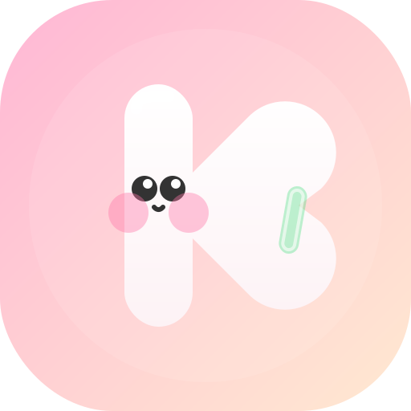
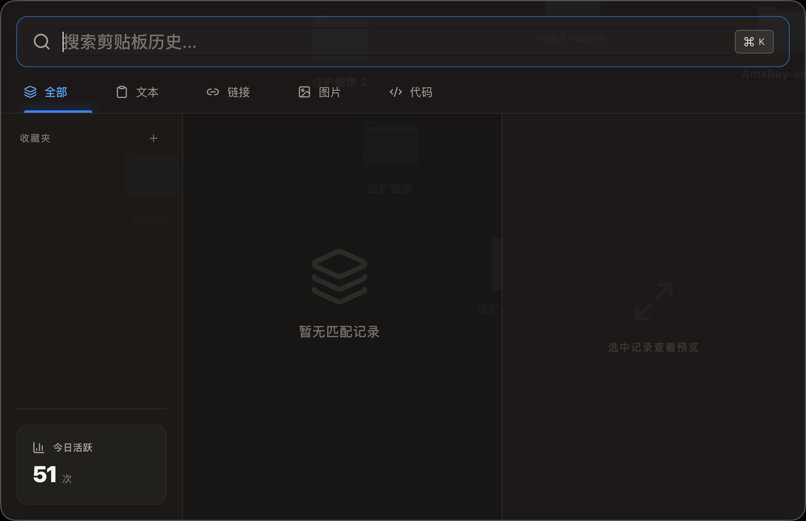
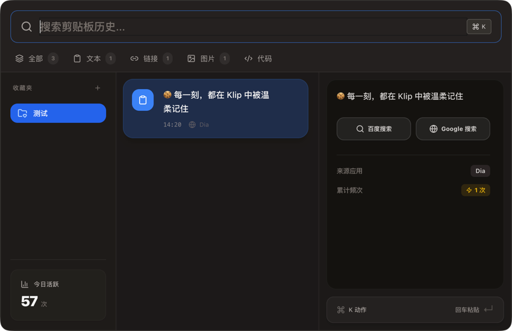

<div align="center">
  
  <h1>Klip</h1>
  <p><strong>A Puffy, Minimalist, and 3D Clay-Styled Clipboard Companion.</strong></p>
  
  <p>
    
    
    
    
  </p>

  <p>
    <a href="#-features">Features</a> •
    <a href="#-preview">Preview</a> •
    <a href="#-why-klip">Why Klip?</a> •
    <a href="#-installation">Installation</a>
  </p>
</div>

---

## 📸 Preview

<div align="center">
  <p><b>✨ Main Interface - Puffy Minimalism ✨</b></p>
  
  
  <br/><br/>

  <p><b>灵动交互 (Interaction & Details)</b></p>
  
</div>

---

### 🍪 每一刻，都在 Klip 中被温柔记住

Klip 是一款拒绝平庸的剪贴板管理工具。我们深知生产力工具不应只有冰冷的线条和灰暗的界面。Klip 采用了 **3D 粘土风格 (Claymorphism)**，将“剪辑”的动作具象化为一个软萌的 K 萌精灵。

> “在 Klip 之前，剪贴板只是一个缓存。在 Klip 之后，它成为了你灵感流转的驿站。”

---

## ✨ Features

- **🌈 视觉治愈**: 全局 3D 拟态设计，每一次呼出都是一次视觉享受。
- **🚀 极速唤起**: 毫秒级的全局唤起响应，Cmd/Ctrl + Shift + V 即刻降临。
- **📸 灵动托盘**: 专为 macOS 优化，拥有一对灵动的瞳孔，在菜单栏中静候你的召唤。
- **📁 全能兼容**: 智能识别并自动分类文本、代码块、高清图像以及各类文件。
- **🗃️ 收藏空间**: 将反复调用的片段一键归类，打造你的个人素材库。
- **🔒 隐私至上**: 离线存储，不上传任何内容，你的所有灵感仅存于你的设备。

---

## 🤔 Why Klip?

| 传统工具 | Klip |
| :--- | :--- |
| 冰冷、生硬的列表 | 软萌、灵动的 3D 界面 |
| 干扰你的桌面空间 | 纯净托盘模式，用完即隐 |
| 枯燥的文字记录 | 赋予记录“生命感”与“情绪价值” |

---

## 🚀 Installation

### Download Latest Version
<p>
  <a href="https://github.com/wuyanzuyizhuce/Klip/releases/latest">
    
  </a>
  <a href="https://github.com/wuyanzuyizhuce/Klip/releases/latest">
    
  </a>
</p>

> **Platform Support**: 
> - **macOS**: Apple Silicon & Intel (11.0+)
> - **Windows**: Windows 10/11 (x64)

### For Developers
```bash
# Clone the repository
git clone https://github.com/wuyanzuyizhuce/Klip.git

# Install dependencies
npm install

# Run in Development
npm run dev

# One-Click Build (Generates DMG & EXE)
npm run build:all
```

---

## 🎨 Branding & Identity

Klip 的品牌核心是 **“陪伴与简洁”**。

- **K-Monster**: 主图标是一个 3D 粘土小精灵。它的身体是由柔软的 K 字母变形而来，象征着它正紧紧抱着你的每一个创意片段。
- **Interaction**: 
  - **左键**: 呼出灵动面板。
  - **右键**: 快速设置与退出。

---

<div align="center">
  <p>MIT License © 2026 Klip Team</p>
  <p>Designed with ❤️ for creative souls.</p>
</div>
